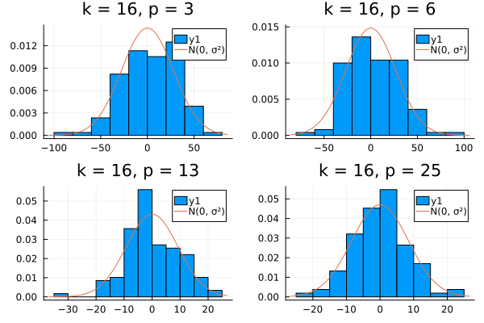
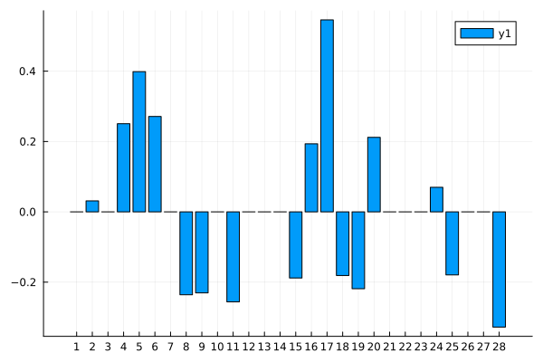

# Exercício

Implemente o modelo e estime-o para o conjunto de dados Air Passengers. Encontre o melhor valor do hiperparâmetro K (minimizando o AICC ou via cross validation) usando `p = 25`. Com o melhor valor de `K`, teste diferentes valores de `p ∈ {3, 6, 13, 25}` e mostre os resíduos associados a cada um desses valores. O objetivo é verificar a captura da sazonalidade pelo modelo conforme o aumento do valor de `p`.

$$
\begin{align}
    \underset{\alpha, \beta, \gamma, \phi}{\text{min}} & \sum_{t=1}^T \epsilon_t^2 \\
    s.t. \quad & \Delta y_t = \alpha + \beta t + \gamma y_{t-1} + \sum_{i=1}^p \Delta y_{t-i} + \epsilon_t \; \forall t \in T \\ 
    & ||\Phi||_0 \le K \; \text{where} \; \Phi = \{\alpha, \beta, \gamma, \phi\}
\end{align}
$$

Considere que o AIC pode ser aproximado por $AIC ~ 2K + T \cdot log(\hat{\sigma}_{\epsilon}^2)$

# Solução

Abaixo está a implementação do modelo apresentado:

```julia
function problem(y::AbstractArray, K::Integer, p::Integer, M::Float64 = 1.)

    dy = diff(y)
    y = y[2:end]
    T = length(y)

    ps = 1 + p # only starts at the p-th element

    global optimizer
    m = Model(optimizer)

    @variable(m, alpha)
    @variable(m, beta)
    @variable(m, gamma)
    @variable(m, theta[1:p])
    @variable(m, epsilon[ps:T])

    @constraint(
        m, 
        [t in ps:T], 
        dy[t] == alpha + beta*t + gamma*y[t-1] + theta'*dy[t-p:t-1] + epsilon[t]
    )

    # # true zero norm to be satisfied
    # @constraint(m, sum(alpha != 0, beta != 0, (theta .!= 0)...) <= K)

    # constraint for the zero norm
    @variable(m, b[1:(p + 3)], Bin)
    @constraint(m, [alpha beta gamma theta...]' .<= M .* b)
    @constraint(m, [alpha beta gamma theta...]' .>= - M .* b)
    @constraint(m, sum(b) <= K)

    @objective(m, Min, sum(epsilon.^2))
    return m
end
```

Considerando que os parâmetros de um modelo ARIMA devem estar limitados a `1`, esse foi o valor escolhido para o `M`. Além disso, é interessante notar que o modelo está estimando a diferença, e não o próprio valor do próximo passo da série, sendo necessário fazer a previsão passo a passo somando sempre o valor encontrado anteriormente (que possui o rascunho de uma solução, mas parece não ter funcionado).

Com o modelo escolhido, o valor de `p = 25` foi fixado, e diferentes valores de `k` foram testados. O melhor valor, considerando a aproximação de AIC apresentada, foi `k = 16`.

```julia
d = Dict()
for k in 1:5:25

    model = problem(y_train, k, 25)
    optimize!(model)

    if termination_status(model) in (MOI.LOCALLY_SOLVED, MOI.OPTIMAL)
        println("Solution found for K = $k")
        println("Objective value: ", objective_value(model))
        kaic = aic(k, length(y), value.(collect(model[:epsilon])))
        println("AIC: ", kaic)
        d[k] = kaic
    else
        println("No solution found with K = $k")
    end
end
best_k = argmin(d) # best_k = 16
```

A partir do valor de `k` encontrado, os diferentes valores de `p` sugeridos foram utilizados.

```julia
for p in (3, 6, 13, 25)

    model = problem(y_train, best_k, p)
    optimize!(model)

    h = histogram(value.(model[:epsilon]).data, normalize = true)
    plot!(h, x -> pdf(Normal(0, std(value.(model[:epsilon]))), x), label="N(0, σ²)")
    title!(h, "k = $best_k, p = $p")
    push!(pplots, h)
end
```

Resultando na visualização:



Infelizmente não é possível determinar qual é o melhor modelo apenas por essa análise dos resíduos, mas é importante notar que quanto maior o valor de `p`, mais próximo os resíduos são de uma distribuição gaussiana. Além disso, é interessante observar os valores escolhidos pelo modelo:



Sendo os índices 1, 2 e 3 correspodentes à `alpha` (intercepto), `beta` (coeficiente angular para o tempo) e `gamma` (autoregressivo de ordem 1); e os outros índices correspondentes ao `theta` (autoregressivo da diferença de ordem `p`).

Assim, se confirma que a série possui tendência (`beta > 0`), e que há uma importante sazonalidade correspondente ao ano anterior, já que diversos dos lags das diferenças possuem valores não zero.
