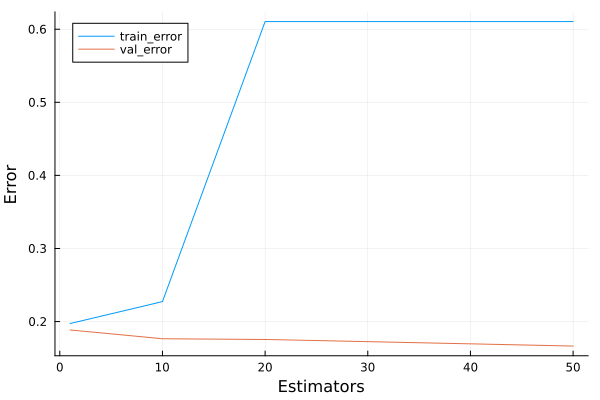
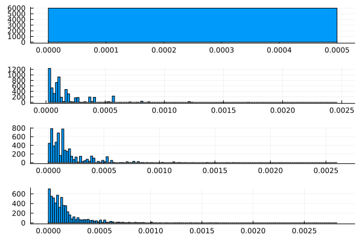
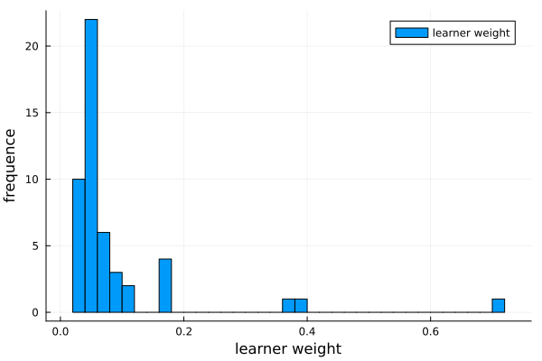

# Exercício

Implemente o algoritmo AdaBoost estudado em aula, utilizando um modelo de classificação binária de sua escolha (DecisionTree de profundinda 1, Heurística simples, etc.) como aprendiz fraco. Utilizando uma base de dados de classificação binária de sua escolha, aplique iterativamente o algoritmo, salvando:

- Erro dentro da amostra;
- Erro fora da amostra; e
- Distribuição de pesos dos dados de treino

Mostrando, ao final, as informações para as iterações 1, 10, 20 e 50.

# Solução

O algoritmo adaboost é um algoritmo de boosting (conjunto de aprendizes treinados iterativamente) que adapta o peso para o treinamento de aprendizes fracos (pelo menos um pouco melhor do que uma chute aleatório) em função dos erros anteriores. Uma possível implementação se encontra abaixo.

```julia
function adaboost(
    (X_train, y_train), 
    (X_val, y_val), 
    n_estimators::Integer
)
    # adapted from https://github.com/JuliaAI/
    # DecisionTree.jl/blob/dev/src/classification/main.jl
    n_samples = size(X_train, 1)
    weights = fill(1 / n_samples, n_samples)
    estimators, estimators_weights = [], []
    for i in 1:n_estimators
        new_stump = build_stump(
            y_train, X_train, weights; impurity_importance=false
        )
        pred_train = apply_tree(new_stump, X_train)
        err = _weighted_error(y_train, pred_train, weights)

        alpha = 0.5 * log((1 - err) / err)
        weights = weights .* exp.(-alpha .* y_train .* pred_train)
        weights = weights ./ sum(weights)
        push!(estimators, deepcopy(new_stump))
        push!(estimators_weights, alpha)
    end
    return estimators, estimators_weights
end
```

Coletando as métricas intemediárias para quando `i` de `n_estimators` atinge os valores de `(1, 10, 20, 50)` (como é feita na função no arquivo [./adaboost.jl](adaboost.jl)), podemos visualizar o experimento de acordo com as figuras abaixo:



O erro dos novos estimadores para a amostra de validação é cada vez maior, como esperado, considerando que cada novo aprendiz é treinado para aprender o que os anteriores erraram; e isso significa que o erro geral da validação reduz conforme mais aprendizes são incorporados com pesos cada vez menores. 



Isso se confirma ao observar os pesos que as observações de treino recebem: a maior parte das amostras recebe um peso próximo de zero, demonstrando que aquelas observações já foram aprendidas anteriormente, e que o foco deveria ser colocado em cima de observações que ainda não foram aprendidas.



Finalmente, é interessante notar que poucos (4) aprendizes tem um peso considerável (maior do que 20%): a maior parte dos aprendizes nesse conjunto existem para melhorar a performance em cima de poucos casos e, logo, recebem um peso pequeno.
