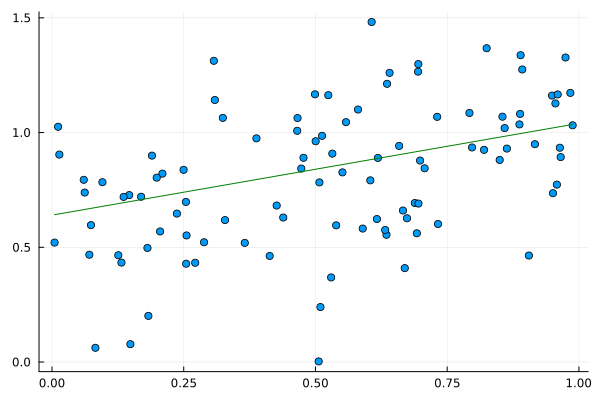
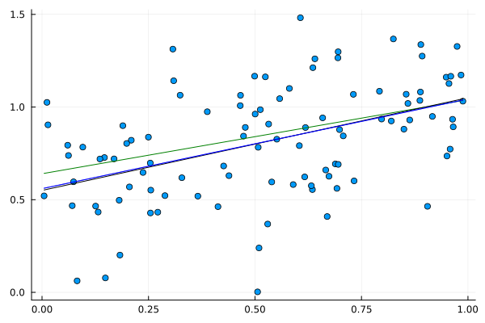
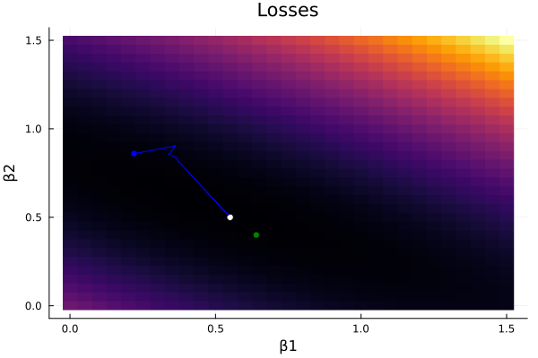
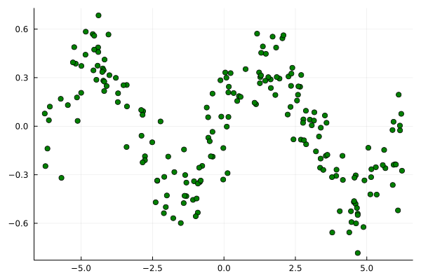
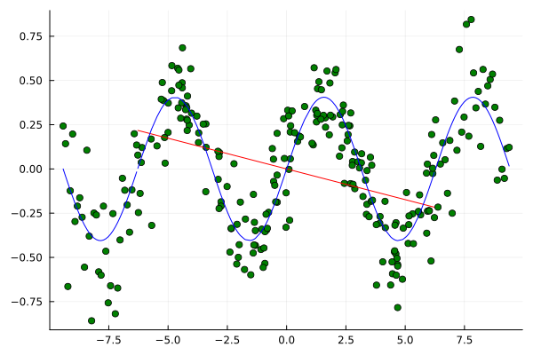
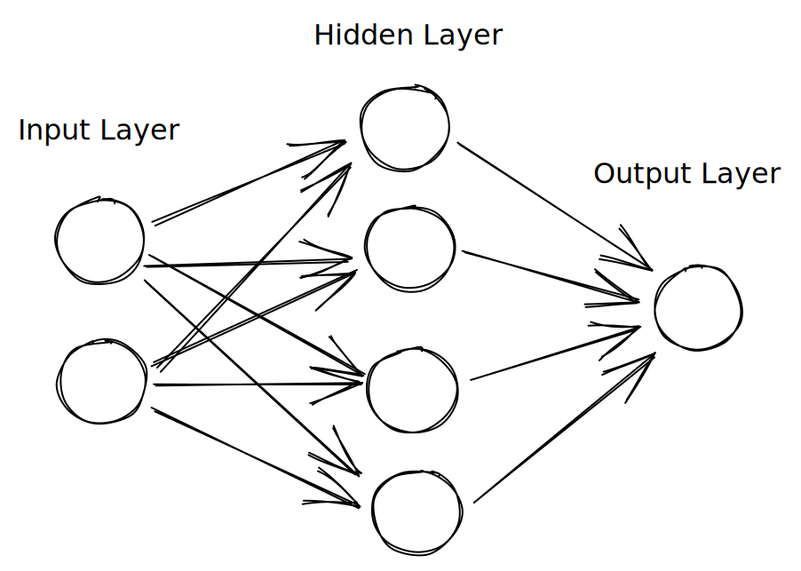

## Neural Networks

### A brief explanation on Neural Networks and Learning

<!-- _footnote: "Author: Felipe Whitaker, 2023.1" -->

---

## Linear Regression

$y = f(x) = \beta_0 + \beta_1 \cdot x + \epsilon$

---

## Closed Form

$$\beta = (X^T \cdot X)^{-1} \cdot X^T \cdot Y$$

<!-- _footnote: "../code/lm-vector.jl" -->

---

## Gradient Descent

$$
\begin{align}
J(\beta) &= \frac{1}{2}(y - \hat{y})^2 = \\
         &= \frac{1}{2}(y - X \cdot \beta)^2 \\
         \\

\beta &= \beta - \eta \cdot \frac{\delta J}{\delta \beta} \\
      &= \beta - \eta \cdot X^T \cdot (X \cdot \beta - y)
\end{align}
$$

<!-- _footnote: "../code/lm-grad.jl" -->

---

## Linear Regression Visualization



---


---


---


---


---


---


---



---

## Gradient Descent Visualization


---


---


---


---


---


---



---

## Gradient Descent Implementation

```julia

# define X, y, β
...

# Calculate the gradient of the cost function with respect to β
∇J = X' * (X * β - y)

# Update β
β -= α * ∇J
```

---

## Feature Engineering

$y = \beta_0 + \beta_1 \cdot sin(x)$



---


---


---


---



---

## Feed Foward



---

## Feed Forward Model

$$
\begin{align}
    h_0 &= f_0(X \cdot W_0 + b_0) \\
    h_i &= f_{i}(h_{i - 1} \cdot W_{i} +b_{i}), \forall i \in \{1, ..., H\} \\
    h_f &= f_{out}(h_{H} \cdot W_{out} + b_{out}) = y
\end{align}
$$

---

## Activation Functions, or what are $f_i$?

e.g.

- $f_i = \frac{1}{1 + e^{-x}}$
- $f_i = \text{max}(0, x)$

<!-- _footnote: "https://fluxml.ai/Flux.jl/stable/models/activation/" -->

---

## Breadth and Depth

TODO universal approximator
TODO problems to generalization (foreshadow trees)

<!-- _footnote: "" -->

---

# Trees

---

# Classification

TODO loss metric
TODO xor example

---

## Stochastic Gradient Descent

TODO [go in depth](https://thenumb.at/Autodiff/)
TODO other ideas: momentum + other optimizers

---

## Implementation

TODO flux
TODO epochs, batches, etc.

<!-- _footnote: "https://thenumb.at/Autodiff/" -->

---

## Loss Visualization

TODO heatmap of loss

---

## Architectures

TODO structured vs non-structured data / how to capture signal

---

## Convolutional Neural Networks

---

## Recurrent Neural Networks

---

## References

Gareth James, Daniela Witten, Trevor Hastie and Robert Tibshirani (2013). **An Introduction to Statistical Learning: with Applications in R**. New York. Springer.

<!-- _footnote: "Disclaimer: the code was checked by a human, but written by a Neural Network" -->

---

## Extra

Fischetti, M., Jo, J. **Deep neural networks and mixed integer linear optimization**. Constraints 23, 296–309 (2018). <https://doi.org/10.1007/s10601-018-9285-6>

Nielsen, M. **A visual proof that neural nets can compute any function**. Neural Networks and Deep Learning (blog). <http://neuralnetworksanddeeplearning.com/chap4.html>

---

Od, L. **Where can I find the proof of the universal approximation theorem?**. Artifical Intelligence StackExchange. <https://ai.stackexchange.com/q/13317>
